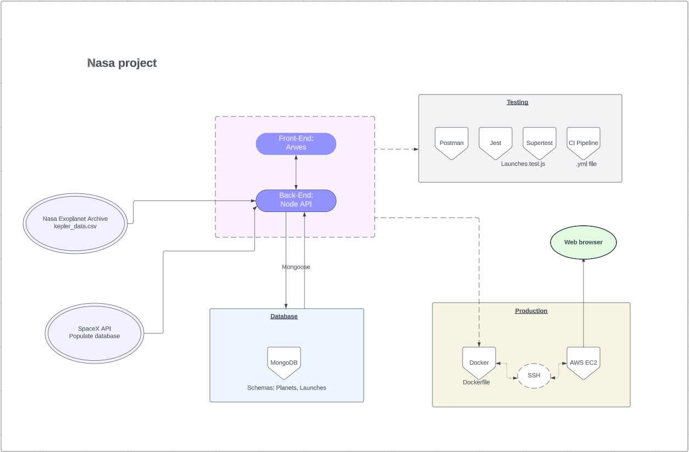

 <h1 align="center">
   Nasa project 
  </h1>

Create fictitious launches that will visite possible habitable planets, keep track of previous launches (aborted or successful), abort planned launches.

This API is the main project of the course on Node.js from Zero To Mastery. While it was a code-along project, it was an apportunity to discover new tools and pratices.

There is more work than meets the eyes, let me tell you more about it!

## Tech Stack

**Client:** React, Science-fiction framework fully created by ARWES

**Server:** Node, Express

**DataBase:** MongoDB, Mongoose

**Test:** Jest, Supertest, Postman

**CI pipeline:** Github Actions

**Production:** Docker, AWS EC2

## Lessons & Thoughts

Throughout the project, the code is heavily commented. The main purpose of this project was learning:

- building an API from scratch with as many layers as a rainbow cake
- using MongoDB, creating schemas and populating the database with extra data (from SpaceX API)
- writing automated tests with Jest and Supertest
- implementing a CI pipeline with Github Actions (in this case, to test different build configurations)
- discovering Docker, writing the Dockerfile to configure the docker image (rainbow cake layers again, this time to minimize work when there is an update)
- creating an EC2 instance on AWS
- connecting the docker image and the EC2 instance with SSH

NoSQL database, Docker, CI/CD, automated tests... Those are words I kept reading without having ever work with them. This is the reason why I chose this course and enjoyed this project. It gave me the opportunity to add signification behind the words with some guidance.

There are many things I do not know, but one step at a time, I keep going further.

## Architecture

   

